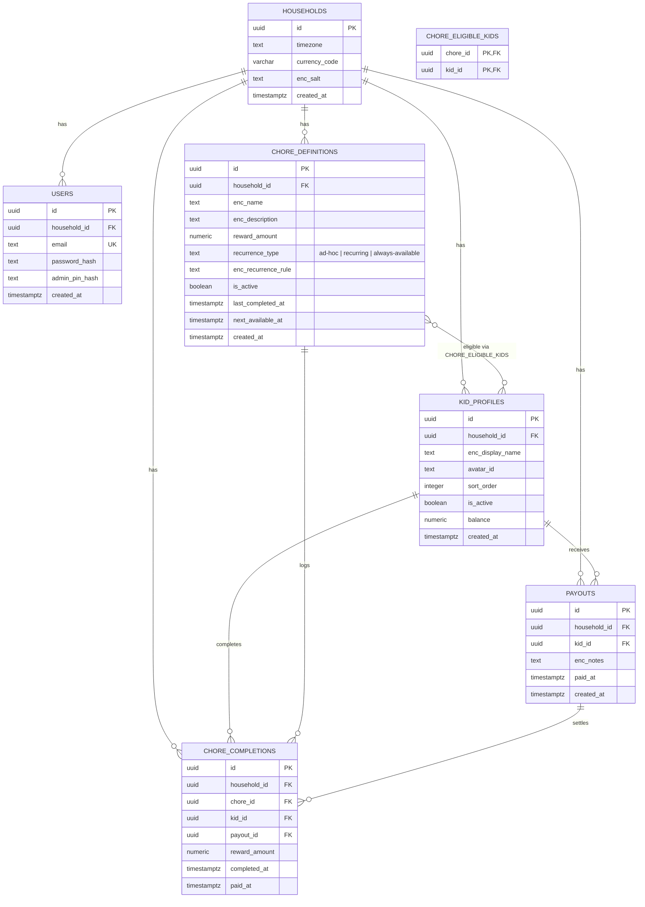

# Chorgie

## Data model

Reflects the current schema in `api/migrations/*.js` (see `CLAUDE.md` for the instruction to keep this in sync).



## Local Docker development

Create a local `.env` file with local-only credentials before starting the stack:

```bash
{
  echo "POSTGRES_USER=chorgie"
  echo "POSTGRES_PASSWORD=$(openssl rand -hex 16)"
  echo "JWT_SECRET=$(openssl rand -hex 32)"
} > .env
```

Run the full local stack with Docker Compose:

```bash
docker compose up --build
```

Services:

- Web UI: http://localhost:5173
- API: http://localhost:3000
- Postgres: localhost:5432

Notes:

- The API container runs database migrations on startup.
- The web app is configured to talk to the local API at `http://localhost:3000`.
- Stop the stack with `docker compose down`.
- Reset the local database with `docker compose down -v`.
